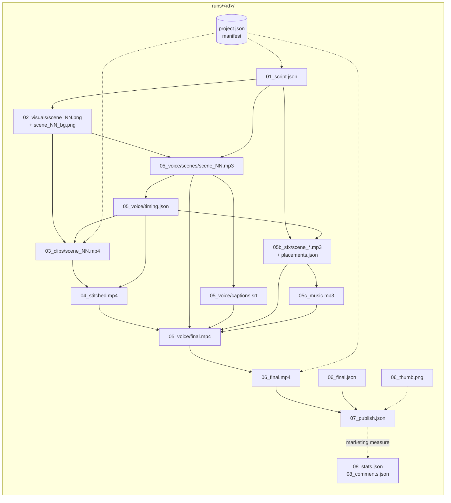
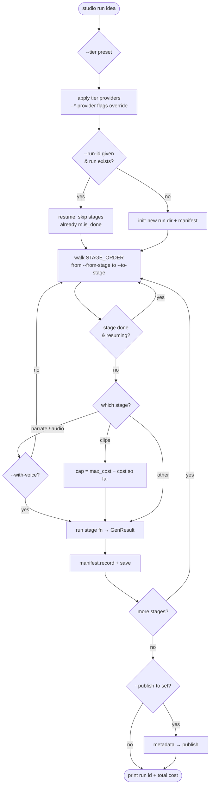
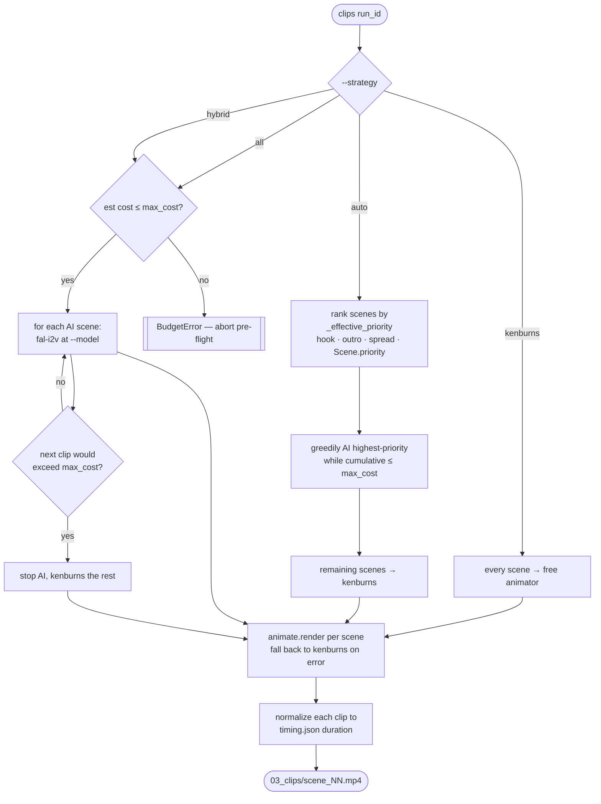
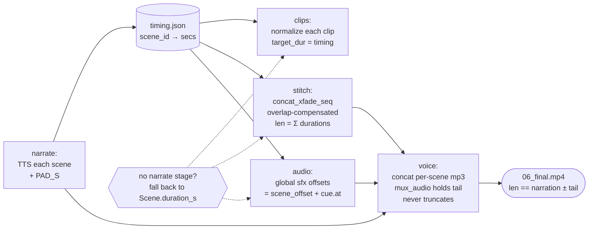
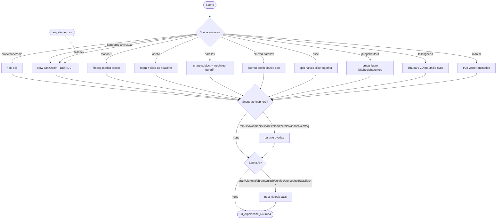
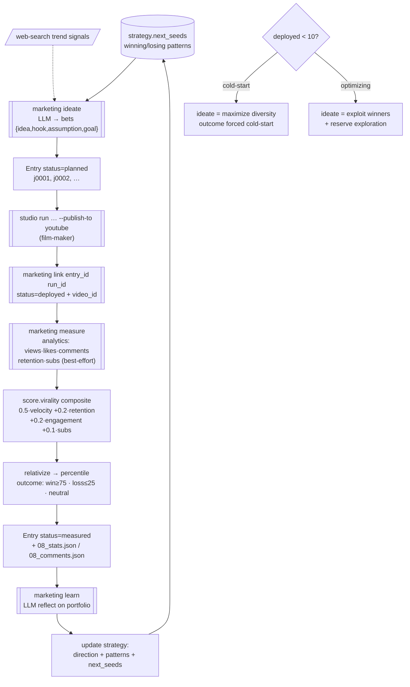
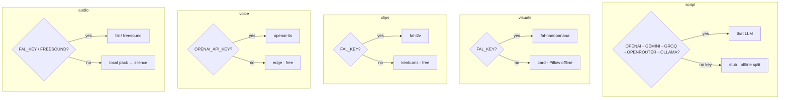
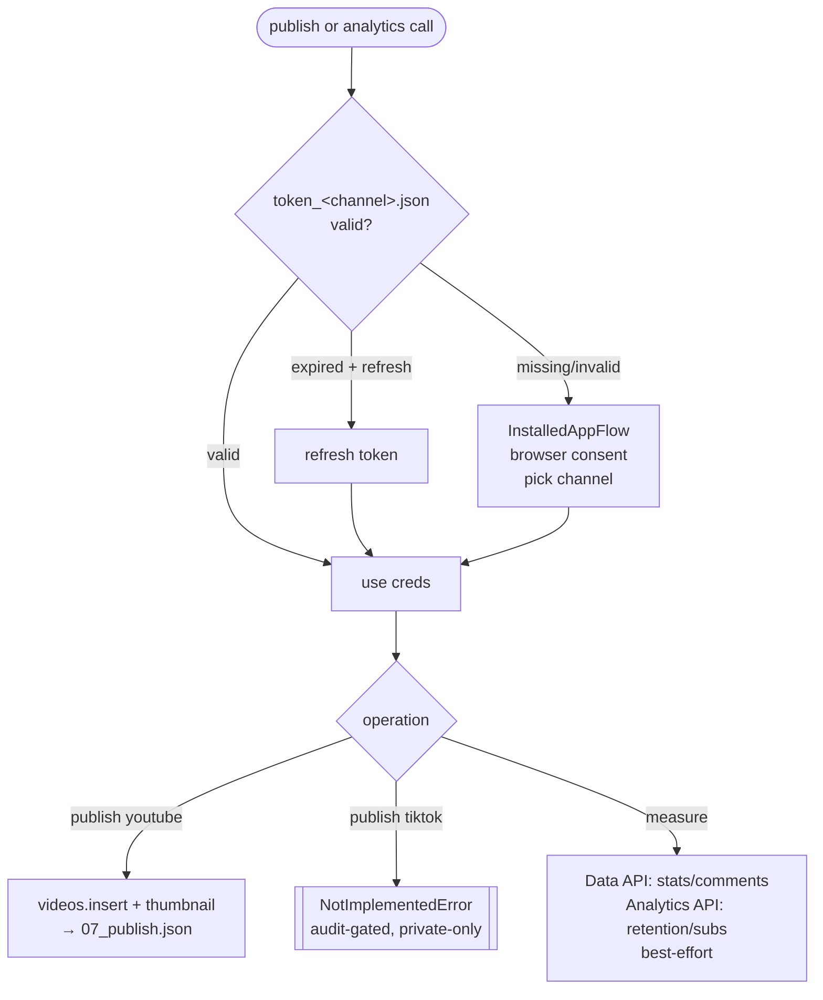
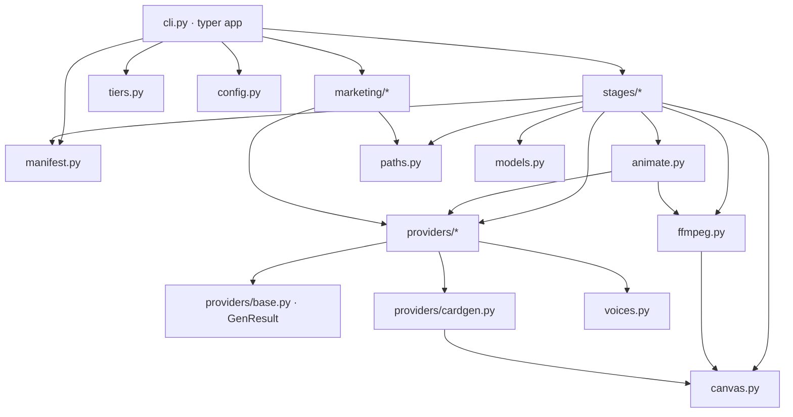

# Workflow Diagrams

Visual reference for how Slope Studio actually runs, drawn from the implemented code
(`studio/`). Mermaid diagrams — GitHub renders them inline. Companion to
[`pipeline-stages.md`](../00-overview/pipeline-stages.md) (artifact contracts) and
[`module-map.md`](module-map.md) (every module's surface).

> Ground truth: `studio/cli.py` `STAGE_ORDER`, the stage functions in `studio/stages/`,
> and `studio/paths.py`. If a diagram and the code disagree, the code wins — fix the diagram.

---

## 1. Pipeline DAG — the 8 stages (+ optional publish)

`STAGE_ORDER = ["script", "visuals", "narrate", "clips", "stitch", "audio", "voice", "save"]`.
`narrate` and `audio` run only when voice is on. `metadata` + `publish` run only when a
publish target is requested.

```mermaid
flowchart TD
    idea([text idea]) --> script

    script[["1 · script<br/>LLM → 01_script.json"]]
    visuals[["2 · visuals<br/>image gen → 02_visuals/scene_NN.png"]]
    narrate[["2.5 · narrate<br/>TTS → per-scene mp3 + timing.json + captions.srt"]]
    clips[["3 · clips<br/>i2v / kenburns → 03_clips/scene_NN.mp4"]]
    stitch[["4 · stitch<br/>ffmpeg → 04_stitched.mp4 (no audio)"]]
    audio[["5b · audio<br/>sfx + music → 05b_sfx/ + 05c_music.mp3"]]
    voice[["5 · voice<br/>mux narration+sfx+music+captions → 05_voice/final.mp4"]]
    save[["6 · save<br/>encode master → 06_final.mp4 + 06_final.json"]]
    metadata[["6.5 · metadata<br/>LLM SEO → 06_final.json"]]
    publish[["7 · publish<br/>upload → 07_publish.json"]]

    script --> visuals --> narrate --> clips --> stitch --> audio --> voice --> save
    save -.->|publish requested| metadata -.-> publish

    narrate -. "timing.json drives durations" .-> clips
    narrate -. timing.json .-> stitch
    narrate -. per-scene mp3 .-> voice
    audio -. placements.json + music .-> voice

    classDef opt fill:#fff3cd,stroke:#d9a800;
    class narrate,audio,metadata,publish opt;
```

Yellow nodes are conditional. `narrate`/`audio` gate on `--with-voice` (default on);
`metadata`/`publish` gate on `--publish-to`.

---

## 2. Artifact data-flow inside `runs/<id>/`

Every stage reads files, writes files. `project.json` (the manifest) is updated after each.



Path source of truth: `studio/paths.py`.

---

## 3. `studio run` chainer — control flow

How `cli.run()` walks `STAGE_ORDER` with resume, conditional stages, and budget gating.



---

## 4. Clips stage — strategy + budget gating

Stage 3 is ~90% of cost. `--strategy` decides which scenes get paid AI video; `--max-cost`
hard-caps spend. Free animators (kenburns and friends) never abort the pipeline.



Run `studio estimate <id>` first — it prices stage 3 per model before you spend.

---

## 5. Audio/video sync — narration drives everything

The whole pipeline length equals the narration length. `narrate` writes `timing.json`
(`{scene_id: seconds}`) from real TTS durations; clips, stitch, and mux all honor it.



Don't reintroduce `-shortest`-style trimming — `mux_audio` deliberately holds the last
frame + tail so audio never gets cut.

---

## 6. Free-animator dispatch (`animate.render`)

Per-scene, free, context-driven. `Scene.animator` picks the base motion; `Scene.atmosphere`
and `Scene.fx` are optional post-passes. Anything that fails degrades to `kenburns`.



Full catalog + ffmpeg/Manim recipes: [`../30-animation/`](../30-animation/README.md).

---

## 7. Marketing loop — ideate → deploy → measure → learn

Per-channel journal at `runs/_marketing/<channel>/`. Cold-start (first 10 deployed)
explores; after that it exploits. `film-maker` produces; `marketing-guru` decides + judges.



Reference: [`../50-marketing/`](../50-marketing/README.md). Score math: `studio/marketing/score.py`.

---

## 8. Provider selection (`config.default_provider`)

Each stage's default provider is chosen by which API keys are present in `.env`, else a
free fallback. `--*-provider` flags and `--tier` presets override.



Source: `studio/config.py`. Tier presets in `studio/tiers.py` set these in bulk.

---

## 9. Publish + analytics OAuth (token reuse)

One per-channel OAuth token (`token_<channel>.json`) is shared by publish and analytics.
Analytics adds the `yt-analytics.readonly` scope (one-time re-consent).



Scopes: `youtube.upload` + `youtube.readonly` (+ `yt-analytics.readonly` for retention/subs).
Source: `studio/providers/publish.py` `_creds()`, `studio/providers/analytics.py`.

---

## 10. Module dependency map

How `studio/` packages depend on each other.



Per-module detail: [`module-map.md`](module-map.md).
</content>
</invoke>
