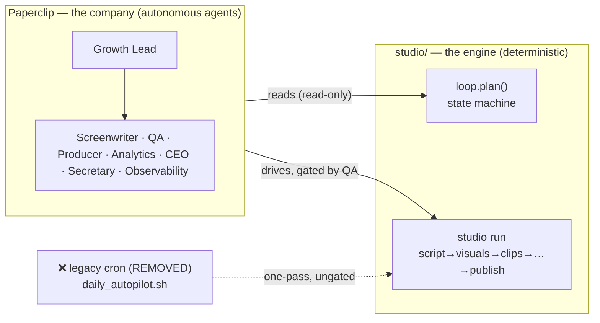
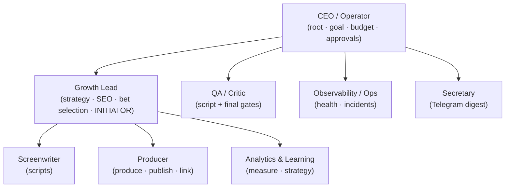
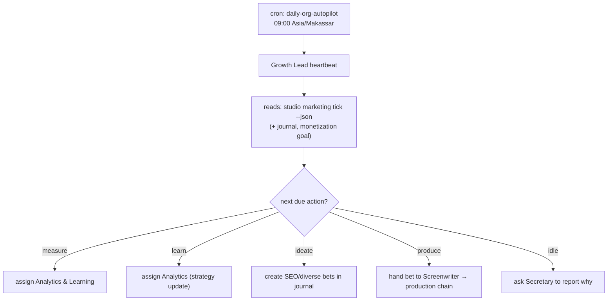
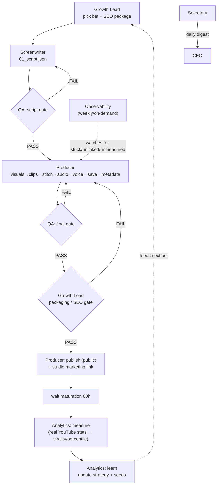
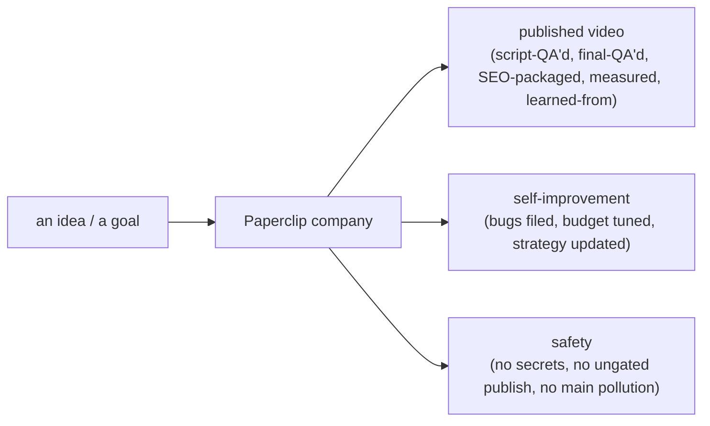

# Paperclip Company — Workflows, Relations & Value

_2026-06-15. How the Slope Studio autonomous agent company is wired, what changed vs the
default internal autopilot, and why. Diagrams are Mermaid (render on GitHub)._

Companion docs: `CURRENT_REVIEW.md` (enhancement plan), `../tmp/PAPERCLIP_REVIEW.md` (runtime review).

---

## 1. Two systems, one engine

There are **two** ways to drive video production. They are not equivalent — the org *wraps* the engine.

- **Internal autopilot (`studio/`)** = a deterministic **state machine** (`marketing/loop.py:plan()`) that picks one action and calls a Python function; `produce` shells out to the `studio run` pipeline. No reasoning, no QA gates beyond the content critic.
- **Paperclip agents** = real autonomous **LLM agents** (Claude) that *reason*, hand work off via issues, and gate quality. They use `studio marketing tick/journal/budget` **read-only** to decide, then drive the same `studio run` engine through role handoffs.
- The **legacy cron was removed** this session so the two stop racing (it published ungated videos behind the org's back).

---

## 2. Org chart (who reports to whom)

Model assignment (set this session): **Opus 4.8** → Screenwriter, QA Critic (creative + gate quality); **Sonnet 4.6** → Growth Lead, Producer, Analytics, CEO; **Haiku 4.5** → Secretary, Observability.

---

## 3. How a cycle starts (the loop)

Only **one** timer remains (the daily initiator). Per-agent idle heartbeats are **disabled** — agents wake on **assignment / @mention / this one cron**, eliminating ~240 no-op wakes/day.

---

## 4. The production chain (gated, with handoffs)

**Golden rule:** every handoff is a *native issue assigned to the next owner* (the assignment trigger wakes that agent). A comment alone does not move work. Publishing is **unattended** (CEO disabled the approval gate this session).

Two memory layers feed this:
- **Journal** (`runs/_marketing/<ch>/journal.json`) = the *learning* memory (bets, metrics, bandit, strategy). Shared with the engine.
- **Paperclip issues/comments** (postgres) = the *coordination* memory (who did what, handoffs, decisions).

---

## 5. What changed vs the default internal agents — and why

| Area | Default internal autopilot | Paperclip org (now) | Why it's better |
|---|---|---|---|
| **Decision** | fixed `if` rules pick the action | Growth Lead **reasons** ("decide what moves the goal, state why") | adapts to context; not locked to a script |
| **Quality** | content critic only, one-pass | **two QA gates** (script + final) + packaging/SEO gate | catches weak scripts *before* paid render; bad videos before publish |
| **Roles** | one process does everything | 8 specialized agents, separation of duties | QA can block Producer; CEO owns policy; no single point doing-it-all |
| **Initiative** | none — runs coded steps | files bugs (SLO-17), retunes budget (SLO-18), opens incidents | the company improves itself |
| **Creativity** | LLM call inside ideate/learn | Screenwriter writes from proven winners, **no rigid template** | better hooks; free-will prompts (live = source of truth) |
| **Memory** | journal only | journal **+** coordination ledger + per-role reflection | accountability + richer learning |
| **Safety** | none — published ungated | enforced: **secret-scan hook, no commits to main, QA gates, budget caps** | the failures we hit (OAuth leak, ungated publish) are now blocked |
| **Cost** | ~1 process, cheap | ~$4–7/video orchestration | the price of reasoning + gates (tunable via model tiers) |

### Changes made this session (and the reason)
1. **Removed legacy cron** — it raced the org and published ungated (e.g. j0024). Org is now sole driver.
2. **All agents → Claude**, idle heartbeats off, 1 cron kept — killed ~240 no-op wakes/day; pinned models (no silent Opus default).
3. **Publish approval disabled** — operator chose unattended publishing; per-video Telegram ping covers notice.
4. **2–3 videos/cycle** — loop `daily_produce_cap=3, cadence=0, backlog_min=3`.
5. **Prompts synced live→repo** — the live managed prompts are the broader/free-will source of truth; repo was stale/rigid. Re-import now preserves freedom.
6. **SLO-39** — unlisted/deleted videos excluded from all stats (percentiles, bandit, learning) so test/retired videos don't skew strategy.
7. **SLO-33 guardrail ACTIVE** — pre-commit hook blocks secrets **and** direct commits to `main`; `safe-commit` bans `git add -A`.

### The hard lesson (the core insight)
The live Producer prompt said *"never commit to main"* — an agent did it anyway; another leaked an OAuth token via `git add -A`. **Instructions don't constrain agents.**

> Grant **creative latitude** through prompts. Enforce **rights & safety** (git, spend, publish) with **guardrails** — not prose.

---

## 6. The value

- **Quality, not just throughput** — every video clears two independent QA gates and an SEO packaging check before it goes public. The engine alone had none of this.
- **A company that learns and fixes itself** — measures real YouTube performance, updates strategy, and even files its own bug/ops tasks.
- **Bounded autonomy** — broad creative freedom where it helps; hard enforcement where mistakes are expensive. The result is an unattended operator you can trust with the publish button *because* the dangerous rights are guarded by code, not hope.
- **One source of truth, reproducible** — live prompts synced to the repo; the whole company is re-importable from `paperclip/company/` (bootstrap), with the engine state in the journal.

---

## 7. Open hardening (tracked, not blocking)
- **Per-agent isolation** — agents share one working tree; concurrent code-committers can collide. Fix = a git worktree per agent, or Paperclip's `executionWorkspacePolicy` isolated mode. Low urgency (coordination agents don't touch files; `main` is protected).
- **Memory write-gate + lock** (SLO-35) — validated journal writes to stop drift + the concurrent load-mutate-save race.
- **Completion verification** — require a committed artifact for "done" (agents marked SLO-36/SLO-39 done without one).
